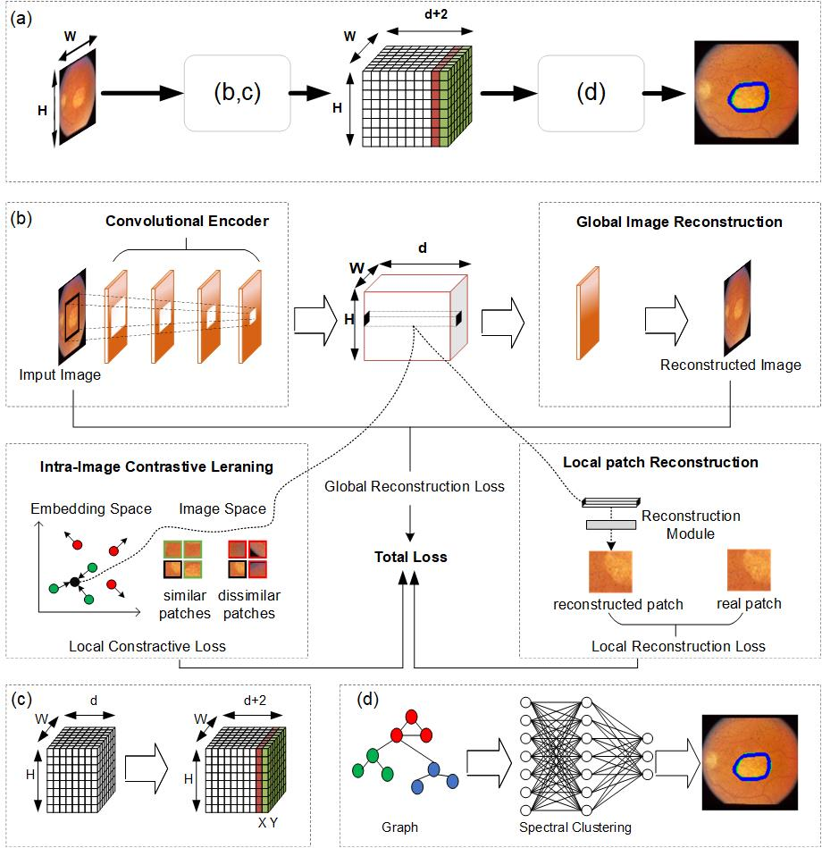
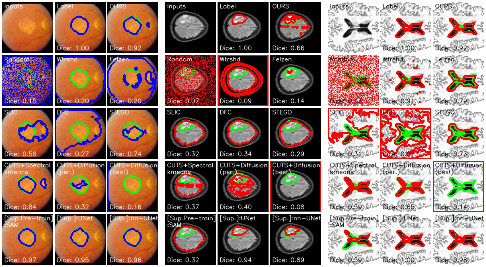
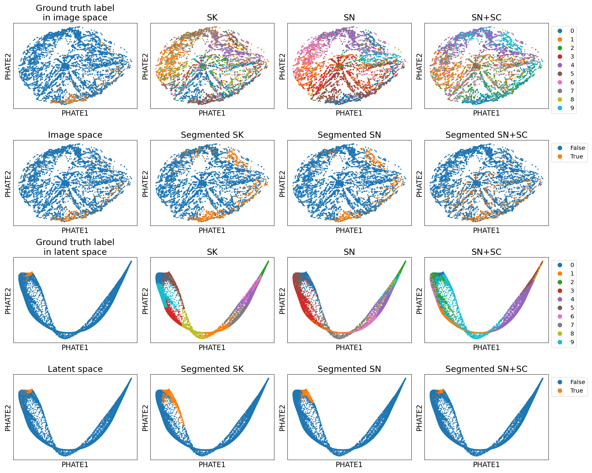

<<<<<<< HEAD
# DRCL
=======
# DRCL: Rethink Jigsaw Puzzles for Unsupervised Medical Image Segmentation
<br>

## A Glimpse into the Methods


## Quick Flavors of the Results



## Repository Hierarchy
```
    (DRCL)
    ├── (*) comparison: other SOTA unsupervised methods for comparison.
    |
    ├── checkpoints: model weights are saved here.
    ├── config: configuration yaml files.
    ├── data: folders containing data files.
    ├── logs: training log files.
    ├── results: generated results (images, labels, segmentations, figures, etc.).
    |
    └── src
        ├── (*) scripts_analysis: scripts for analysis and plotting.
        |   ├── `generate_baselines.py`
        |   ├── `generate_kmeans.py`
        |   ├── `generate_diffusion.py`
        |   ├── `plot_paper_figure_main.py`
        |   └── `run_metrics.py`
        |
        ├── (*) `main.py`: unsupervised training of the DCCL encoder.
        ├── (*) `main_supervised.py`: supervised training of UNet/nnUNet for comparison.
        |
        ├── datasets: defines how to access and process the data in `DDCL/data/`.
        ├── data_utils
        ├── model
        └── utils

Relatively core files or folders are marked with (*).
```

## Data Provided
The `retina` datasets are provided in `zip` format. The `brain_ventricles` dataset exceeds the GitHub size limits, and can be made available upon reasonable request.

## To reproduce the results in the paper.
The following commands are using `retina_seed2` as an example (retina dataset, random seed set to 2022).

<details>
  <summary>Unzip data</summary>

```
cd ./data/
unzip retina.zip
```
</details>

<details>
  <summary>Activate environment</summary>

```
conda activate dccl
```
</details>

<details>
  <summary><b>Stage 1.</b> Training the convolutional encoder</summary>

#### To train a model.
```
## Under `src`
python main.py --mode train --config ../config/retina_seed2.yaml
```
#### To test a model (automatically done during `train` mode).
```
## Under `src`
python main.py --mode test --config ../config/retina_seed2.yaml
```
</details>

<details>
  <summary>(Optional) [Comparison] Training a supervised model</summary>

```
## Under `src/`
python main_supervised.py --mode train --config ../retina_seed2.yaml
```
</details>

<details>
  <summary><b>Stage 2.</b> Results Generation</summary>

#### To generate and save the segmentation using spectral k-means.
```
## Under `src/scripts_analysis`
python generate_kmeans.py --config ../../config/retina_seed2.yaml
```

#### To generate and save the segmentation using spectralNet.
```
## Under `src/scripts_analysis`
python generate_spectralnet.py --config ../../config/retina_seed2.yaml
```


#### To generate and save the segmentation using pos_spectralNet.
```
## Under `src/scripts_analysis`
python generate_pos_spectralnet.py --config ../../config/retina_seed2.yaml
```

#### To generate and save the segmentation using diffusion condensation.
```
## Under `src/scripts_analysis`
python generate_diffusion.py --config ../../config/retina_seed2.yaml
```
#### To generate and save the segmentation using baseline methods.
```
## Under `src/scripts_analysis`
python generate_baselines.py --config ../../config/retina_seed2.yaml
```
</details>

<details>
  <summary>Results Plotting</summary>

#### To reproduce the figures in the paper.
There is one single script for this purpose (previously two but we recently merged them): `plot_paper_figure_main.py`.

The `image-idx` argument shall be followed by space-separated index/indices of the images to be plotted.

Without the `--comparison` flag, the DDCL-only results will be plotted.
With the ` --comparison` flag, the side-by-side comparison against other methods will be plotted.

With the ` --grayscale` flag, the input images and reconstructed images will be plotted in grayscale.

With the `--binary` flag, the labels will be binarized using a consistent method described in the paper.

With the `--separate` flag, the labels will be displayed as separate masks. Otherwise they will be overlaid. This flag is altomatically turned on (and cannot be turned off) for multi-class segmentation cases.

```
## Under `src/scripts_analysis`

## For natural images (berkeley), multi-class segmentation.
### Diffusion condensation trajectory.
python plot_paper_figure_main.py --config ../../config/berkeley_seed2.yaml --image-idx 8 22 89
### Segmentation comparison.
python plot_paper_figure_main.py --config ../../config/berkeley_seed2.yaml --image-idx 8 22 89 --comparison --separate

## For medical images with color (retina), binary segmentation.
### Diffusion condensation trajectory.
python plot_paper_figure_main.py --config ../../config/retina_seed2.yaml --image-idx 4 7 18
### Segmentation comparison (overlay).
python plot_paper_figure_main.py --config ../../config/retina_seed2.yaml --image-idx 4 7 18 --comparison --binary
### Segmentation comparison (non-overlay).
python plot_paper_figure_main.py --config ../../config/retina_seed2.yaml --image-idx 4 7 18 --comparison --binary --separate

## For medical images without color (brain ventricles, brain tumor), binary segmentation.
### Diffusion condensation trajectory.
python plot_paper_figure_main.py --config ../../config/brain_ventricles_seed2.yaml --image-idx 35 41 88 --grayscale
### Segmentation comparison (overlay).
python plot_paper_figure_main.py --config ../../config/brain_ventricles_seed2.yaml --image-idx 35 41 88 --grayscale --comparison --binary
### Segmentation comparison (non-overlay).
python plot_paper_figure_main.py --config ../../config/brain_ventricles_seed2.yaml --image-idx 35 41 88 --grayscale --comparison --binary --separate
### Diffusion condensation trajectory.
python plot_paper_figure_main.py --config ../../config/brain_tumor_seed2.yaml --image-idx 1 25 31 --grayscale
### Segmentation comparison (overlay).
python plot_paper_figure_main.py --config ../../config/brain_tumor_seed2.yaml --image-idx 1 25 31 --grayscale --comparison --binary
### Segmentation comparison (non-overlay).
python plot_paper_figure_main.py --config ../../config/brain_tumor_seed2.yaml --image-idx 1 25 31 --grayscale --comparison --binary --separate

## We also have an option to not overlay binary segmentation.
python plot_paper_figure_main.py --config ../../config/retina_seed2.yaml --image-idx 4 7 14 --comparison --binary

```
</details>

<details>
  <summary>Results Analysis</summary>

#### To compute the quantitative metrics (single experiment).
Assuming segmentation results have already been generated and saved.
```
## Under $DCCL_ROOT/src/scripts_analysis
python run_metrics.py --config ../../config/retina_seed2.yaml
```

#### To compute the quantitative metrics (multiple experiments).
Assuming segmentation results have already been generated and saved.
```
## Under $DCCL_ROOT/src/scripts_analysis
python run_metrics.py --config ../../config/retina_seed1.yaml ../../config/retina_seed2.yaml ../../config/retina_seed3.yaml
```

## Dependencies
We developed the codebase in a miniconda environment.
Tested on Python 3.9.13 + PyTorch 1.12.1.
How we created the conda environment:
```
conda create --name dccl pytorch==1.12.1 torchvision==0.13.1 torchaudio==0.12.1 cudatoolkit=11.3 -c pytorch
conda activate dccl
conda install scikit-image pillow matplotlib seaborn tqdm -c anaconda
python -m pip install -U phate
python -m pip install multiscale-phate
python -m pip install git+https://github.com/KrishnaswamyLab/CATCH
python -m pip install opencv-python-headless
python -m pip install sewar
python -m pip install monai
python -m pip install nibabel
```
</details>

## Acknowledgements

  For the comparison against other methods, we use the official implementations from the following repositories:
  - [**DFC**, *IEEE TIP 2020*: Unsupervised Learning of Image Segmentation Based on Differentiable Feature Clustering](https://github.com/kanezaki/pytorch-unsupervised-segmentation-tip)
  - [**STEGO**, *ICLR 2022*: Unsupervised Semantic Segmentation by Distilling Feature Correspondences](https://github.com/mhamilton723/STEGO)
  - [**SAM**, *Arxiv* (Meta AI Research): Segment Anything](https://github.com/facebookresearch/segment-anything)
  - [**SAM**, *Medical Image Analysis 2024*: Segment Anything Model for Medical Image Analysis: an Experimental Study](https://github.com/mazurowski-lab/segment-anything-medical-evaluation)
  - [**CUTS**, *arXiv 2022*: A Framework for Multigranular Unsupervised Medical Image Segmentation](https://github.com/ChenLiu-1996/UnsupervisedMedicalSeg)

>>>>>>> Initial commit
